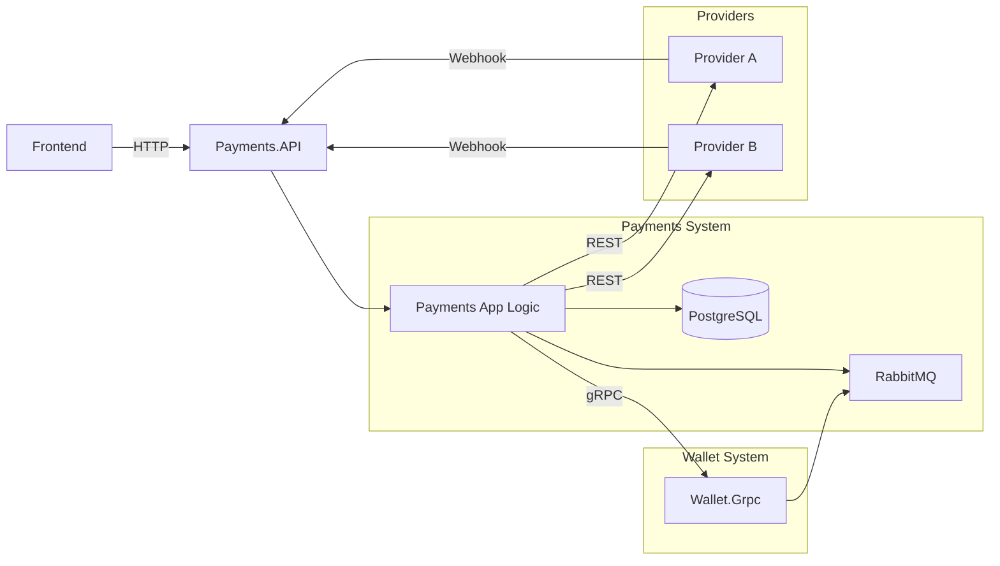
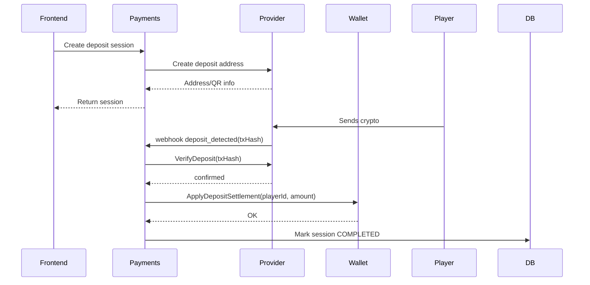
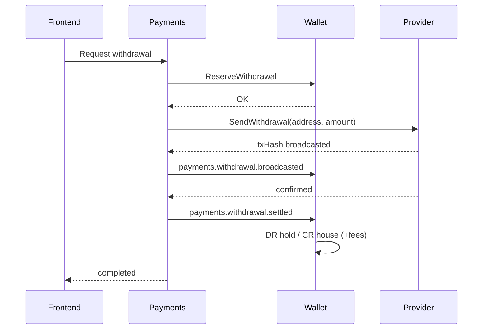

# 🧱 Payments System — Technical Documentation  
### (.NET 9 • PostgreSQL • RabbitMQ • gRPC • REST • External Payment Providers)

---

# 🧭 1. Purpose & Scope

The **Payments System** orchestrates all real-world financial operations between:

- **Frontend (player actions)**  
- **External payment providers** (crypto gateways, custodians)  
- **Wallet System** (internal ledger authority)

Payments handles two primary flows **initiated by the player**:

### ✔ Deposits (player → casino)
- Generate deposit session (QR/address)  
- Receive provider webhooks  
- Verify on-chain payments  
- Notify Wallet to credit funds  

### ✔ Withdrawals (casino → player)
- FE requests withdrawal  
- Payments reserves funds via Wallet  
- Executes payout via provider  
- Receives confirmations  
- Finalizes withdrawal in Wallet  

Payments is responsible for:

- External provider integrations  
- Deposit & withdrawal state machines  
- Provider webhooks  
- Idempotency and replay safety  
- Event-driven sync with Wallet  
- All DB state for sessions, deposits, withdrawals  
- Minor-unit money handling  

Wallet **never interacts with providers** — Payments does all external operations.

---

# 🧩 2. High-Level Architecture



**Key principles**

- FE → Payments = all real-money requests  
- Payments → Providers = send/receive blockchain/fiat actions  
- Payments → Wallet = gRPC settlement & reservation  
- Wallet never talks to providers  
- Payments owns deposit & withdrawal state  

---

# 🔁 3. Execution Flows

---

## 💰 3.1 Deposit Flow (Player → Casino)



### Summary of steps

1. Player initiates deposit  
2. Payments asks provider for deposit address/QR  
3. Provider detects incoming on-chain TX  
4. Provider sends webhook  
5. Payments verifies TX  
6. Payments notifies Wallet to credit player  
7. Wallet applies ledger postings  
8. Payments finalizes deposit session  

---

## 💸 3.2 Withdrawal Flow (Casino → Player)



### Summary of steps

1. FE sends withdrawal request  
2. Payments locks funds via Wallet  
3. Payments sends withdrawal to provider  
4. Provider broadcasts TX  
5. Provider confirms  
6. Payments notifies Wallet of settlement  
7. Wallet finalizes ledger postings  
8. FE sees success  

---

# 🧱 4. Database Schema

Payments stores:

- Provider definitions  
- Deposit sessions  
- Deposit requests  
- Withdrawal requests  
- Outbox events  
- Inbox events  
- Idempotency keys  

Wallet stores ledger — **Payments does not**.

---

## 🧱 4.1 payment_providers

```sql
CREATE TABLE payment_providers (
  provider_id SERIAL PRIMARY KEY,
  name TEXT NOT NULL,
  type TEXT NOT NULL CHECK (type IN ('CRYPTO','FIAT')),
  api_base_url TEXT,
  is_active BOOLEAN DEFAULT TRUE,
  created_at TIMESTAMPTZ DEFAULT now()
);
```

---

## 🧱 4.2 deposit_sessions

```sql
CREATE TABLE deposit_sessions (
  session_id UUID PRIMARY KEY,
  player_id BIGINT NOT NULL,
  provider_id INT NOT NULL REFERENCES payment_providers(provider_id),
  currency_network_id INT NOT NULL REFERENCES currency_networks(currency_network_id),
  address TEXT NOT NULL,
  memo_or_tag TEXT,
  provider_reference TEXT,
  expected_amount_minor BIGINT,
  min_amount_minor BIGINT,
  confirmations_required INT NOT NULL DEFAULT 1,
  status TEXT NOT NULL CHECK (status IN ('OPEN','EXPIRED','COMPLETED')),
  expires_at TIMESTAMPTZ,
  metadata JSONB NOT NULL DEFAULT '{}',
  created_at TIMESTAMPTZ DEFAULT now(),
  updated_at TIMESTAMPTZ DEFAULT now()
);
```

---

## 🧱 4.3 deposit_requests

```sql
CREATE TABLE deposit_requests (
  deposit_id UUID PRIMARY KEY,
  session_id UUID REFERENCES deposit_sessions(session_id),
  player_id BIGINT NOT NULL,
  provider_id INT NOT NULL REFERENCES payment_providers(provider_id),
  currency_network_id INT NOT NULL REFERENCES currency_networks(currency_network_id),
  tx_hash TEXT UNIQUE NOT NULL,
  amount_minor BIGINT NOT NULL,
  confirmations_received INT DEFAULT 0,
  confirmations_required INT DEFAULT 1,
  status TEXT CHECK (status IN ('PENDING','CONFIRMED','SETTLED','FAILED')),
  metadata JSONB NOT NULL DEFAULT '{}',
  created_at TIMESTAMPTZ DEFAULT now(),
  updated_at TIMESTAMPTZ DEFAULT now()
);
```

---

## 🧱 4.4 withdrawal_requests

```sql
CREATE TABLE withdrawal_requests (
  withdrawal_id UUID PRIMARY KEY,
  player_id BIGINT NOT NULL,
  provider_id INT NOT NULL REFERENCES payment_providers(provider_id),
  currency_network_id INT NOT NULL REFERENCES currency_networks(currency_network_id),
  amount_minor BIGINT NOT NULL,
  fee_minor BIGINT DEFAULT 0,
  target_address TEXT NOT NULL,
  provider_reference TEXT,
  tx_hash TEXT,
  status TEXT CHECK (status IN ('REQUESTED','PROCESSING','BROADCASTED','SETTLED','FAILED')),
  fail_reason TEXT,
  metadata JSONB DEFAULT '{}',
  created_at TIMESTAMPTZ DEFAULT now(),
  updated_at TIMESTAMPTZ DEFAULT now()
);
```

---

## 🧱 4.5 idempotency_keys, outbox_events, inbox_events

```sql
CREATE TABLE idempotency_keys (...);
CREATE TABLE outbox_events (...);
CREATE TABLE inbox_events (...);
```

Payments uses outbox/inbox for **reliable messaging**.

---

# 🌐 5. Payments.API Endpoints

## 5.1 Create Deposit Session

```
POST /api/deposits/sessions
```

Request:
```json
{
  "currency": "USDT",
  "network": "TRON",
  "expectedAmountMajor": 50,
  "expiresInSeconds": 1800,
  "idempotencyKey": "dep_1234"
}
```

Response:
```json
{
  "sessionId": "uuid",
  "address": "Txyz...",
  "qrUri": "tron:Txyz...?amount=50",
  "expiresAt": "2025-03-01T12:00:00Z",
  "confirmationsRequired": 1
}
```

---

## 5.2 Request Withdrawal

```
POST /api/withdrawals
```

Request:
```json
{
  "currency": "USDT",
  "network": "TRON",
  "amountMajor": 25,
  "targetAddress": "TXabc...",
  "idempotencyKey": "wd_123"
}
```

Response:
```json
{
  "requestId": "uuid",
  "status": "PROCESSING"
}
```

---

## 5.3 Provider Webhooks

```
POST /api/providers/{providerId}/webhook
```

Handles:

- deposit_detected  
- withdrawal_broadcast  
- withdrawal_confirmed  
- failed  

---

# 🔌 6. Payments → Wallet (gRPC)

## 6.1 ReserveWithdrawal

```proto
rpc ReserveWithdrawal (ReserveWithdrawalRequest) returns (OperationResult);
```

Moves MAIN → WITHDRAW_HOLD.

---

## 6.2 ApplyDepositSettlement

```proto
rpc ApplyDepositSettlement (DepositSettlementRequest) returns (OperationResult);
```

Moves HOUSE → MAIN.

---

# 🧠 7. Provider Integration Layer

Payments defines a unified interface:

```csharp
public interface IPaymentProvider
{
    Task<CreateDepositSessionResult> CreateDepositSessionAsync(...);
    Task<ProviderDepositResult> VerifyDepositAsync(string txHashOrRef);
    Task<ProviderWithdrawalResult> SendWithdrawalAsync(WithdrawalRequest request);
    Task<ProviderTransactionStatus> GetTransactionStatusAsync(string reference);
}
```

Provider adapters (BitGo, Fireblocks, etc.) implement this.

---

# 🔁 8. Background Workers

| Worker | Role |
|--------|------|
| OutboxPublisher | publishes events reliably |
| InboxConsumer | processes wallet events |
| ProviderPoller | checks confirmations via provider API |
| ReconciliationJob | compares provider vs DB |

---

# 🧮 9. Minor Units

All amounts use:

```
amount_minor = amount_major * 10^decimals
```

Decimals come from `currency_networks`.

---

# 📨 10. Events

## payments.deposit.settled

```json
{
  "playerId": 42,
  "currency": "USDT",
  "network": "TRON",
  "amountMinor": 50000000,
  "txHash": "0xabc..."
}
```

## payments.withdrawal.settled

```json
{
  "playerId": 42,
  "amountMinor": 25000000,
  "txHash": "0xdef..."
}
```

---

# 📘 11. Summary

- FE always talks to Payments first  
- Payments integrates with providers (deposit & withdrawal)  
- Payments settles everything through Wallet  
- Wallet holds authoritative balances  
- Minor units ensure precision  
- Idempotency ensures safety  
- Outbox/Inbox ensures reliable messaging  
- Works across multiple pods safely  

---

# 🧱 END OF PAYMENTS SYSTEM DOCUMENTATION
