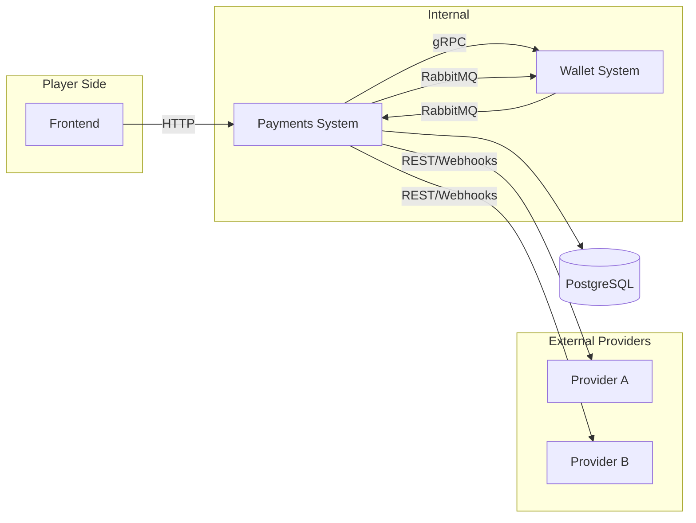
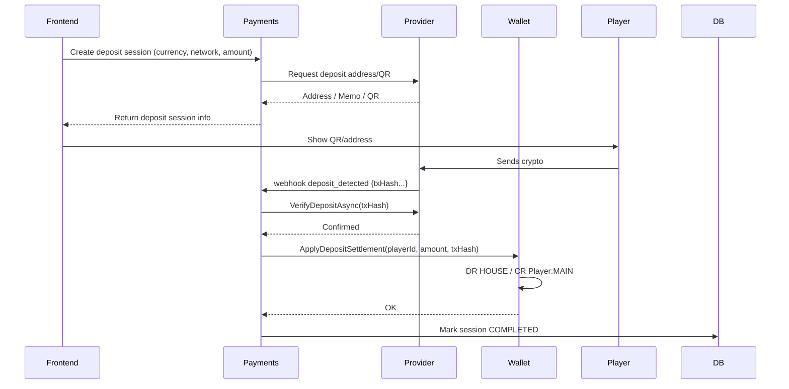
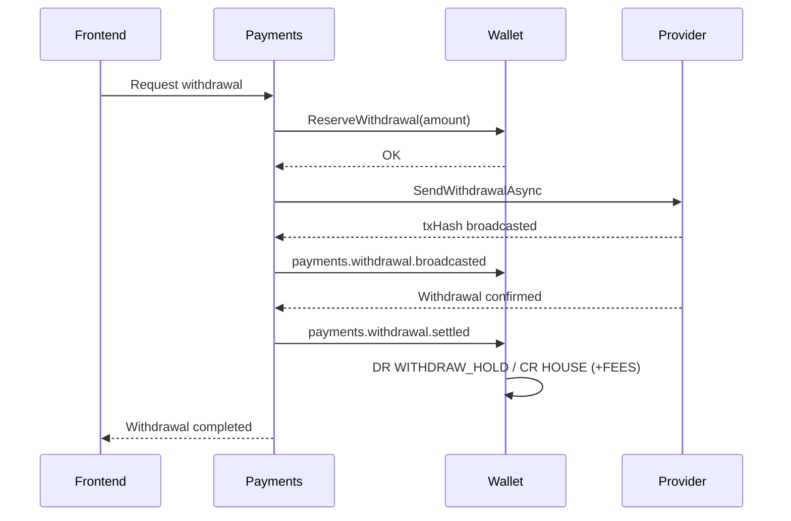

# Payments System — Technical Documentation  
### (.NET 9 • PostgreSQL • RabbitMQ • gRPC • REST • External Providers)

---

# 1. Purpose & Scope

The Payments System is responsible for orchestrating real-world money movement between the player’s frontend, the Wallet System (internal accounting ledger), and external payment providers (crypto gateways, custodians, processors).

The Payments System handles two major flows triggered **directly by the player**:

1. **Deposit** – Player sends funds → Provider detects transaction → Payments verifies → Wallet credits player.  
2. **Withdrawal** – Player requests payout → Payments reserves funds via Wallet → Provider executes payout → Payments finalizes transaction → Wallet finalizes accounting.

Payments ensures:

- Accurate provider integration  
- Atomic communication with Wallet  
- Correct sequence and verification of external transactions  
- Exactly-once execution via idempotency keys  
- Event-driven consistency via RabbitMQ  
- Integer-only money handling (minor units)  
- Complete auditability  

Wallet = **balance authority**  
Payments = **real-world money orchestrator**  
Providers = **external transaction executors**  

---

# 2. High-Level Architecture



**Important:**  
This architecture diagram shows **connections**, not **call order**.  
Deposit and withdrawal executions are detailed step-by-step below.

---

# 3. Execution Flows

---

## 3.1 Deposit Flow (Player → Casino)



### Step-by-step deposit explanation

1. **Frontend → Payments**  
   Player requests a deposit; Payments creates a deposit session.

2. **Payments → Provider**  
   Payments asks the provider to generate a deposit QR/address.

3. **Frontend → Player**  
   The player sees the address/QR.

4. **Player → Provider**  
   Player sends crypto to the provider-controlled wallet.

5. **Provider → Payments**  
   Provider sends `deposit_detected` webhook.

6. **Payments → Provider**  
   Payments verifies transaction authenticity and confirmations.

7. **Payments → Wallet**  
   Payments calls Wallet to credit player funds.

8. **Wallet**  
   Performs ledger postings: `DR HOUSE / CR Player:MAIN`.

9. **Payments**  
   Marks session completed.

---

## 3.2 Withdrawal Flow (Casino → Player)



### Step-by-step withdrawal explanation

1. Frontend sends a withdrawal request.  
2. Payments asks Wallet to reserve funds.  
3. Wallet moves funds to `WITHDRAW_HOLD`.  
4. Payments calls provider to execute payout.  
5. Provider broadcasts on-chain transaction.  
6. Payments notifies Wallet.  
7. Provider confirms finality.  
8. Payments notifies Wallet to finalize.  
9. Wallet performs postings:  
   `DR WITHDRAW_HOLD / CR HOUSE (+FEES)`  
10. Frontend shows success.

---

# 4. Database Schema

All money is stored in **minor units (integers)**.

---

## 4.1 payment_providers

```sql
CREATE TABLE payment_providers (
  provider_id SERIAL PRIMARY KEY,
  name TEXT NOT NULL,
  type TEXT NOT NULL CHECK (type IN ('CRYPTO','FIAT')),
  api_base_url TEXT,
  is_active BOOLEAN DEFAULT TRUE,
  created_at TIMESTAMPTZ DEFAULT now()
);
```

---

## 4.2 deposit_sessions

```sql
CREATE TABLE deposit_sessions (
  session_id UUID PRIMARY KEY,
  player_id BIGINT NOT NULL,
  provider_id INT NOT NULL REFERENCES payment_providers(provider_id),
  currency_network_id INT NOT NULL REFERENCES currency_networks(currency_network_id),
  address TEXT NOT NULL,
  memo_or_tag TEXT,
  provider_reference TEXT,
  expected_amount_minor BIGINT,
  min_amount_minor BIGINT,
  confirmations_required INT NOT NULL DEFAULT 1,
  status TEXT NOT NULL CHECK (status IN ('OPEN','EXPIRED','COMPLETED')),
  expires_at TIMESTAMPTZ,
  metadata JSONB NOT NULL DEFAULT '{}',
  created_at TIMESTAMPTZ DEFAULT now(),
  updated_at TIMESTAMPTZ DEFAULT now()
);
```

---

## 4.3 deposit_requests

```sql
CREATE TABLE deposit_requests (
  deposit_id UUID PRIMARY KEY,
  session_id UUID REFERENCES deposit_sessions(session_id),
  player_id BIGINT NOT NULL,
  provider_id INT NOT NULL REFERENCES payment_providers(provider_id),
  currency_network_id INT NOT NULL REFERENCES currency_networks(currency_network_id),
  tx_hash TEXT UNIQUE NOT NULL,
  amount_minor BIGINT NOT NULL,
  confirmations_received INT DEFAULT 0,
  confirmations_required INT DEFAULT 1,
  status TEXT CHECK (status IN ('PENDING','CONFIRMED','SETTLED','FAILED')),
  metadata JSONB NOT NULL DEFAULT '{}',
  created_at TIMESTAMPTZ DEFAULT now(),
  updated_at TIMESTAMPTZ DEFAULT now()
);
```

---

## 4.4 withdrawal_requests

```sql
CREATE TABLE withdrawal_requests (
  withdrawal_id UUID PRIMARY KEY,
  player_id BIGINT NOT NULL,
  provider_id INT NOT NULL REFERENCES payment_providers(provider_id),
  currency_network_id INT NOT NULL REFERENCES currency_networks(currency_network_id),
  amount_minor BIGINT NOT NULL,
  fee_minor BIGINT DEFAULT 0,
  target_address TEXT NOT NULL,
  provider_reference TEXT,
  tx_hash TEXT,
  status TEXT CHECK (status IN ('REQUESTED','PROCESSING','BROADCASTED','SETTLED','FAILED')),
  fail_reason TEXT,
  metadata JSONB DEFAULT '{}',
  created_at TIMESTAMPTZ DEFAULT now(),
  updated_at TIMESTAMPTZ DEFAULT now()
);
```

---

## 4.5 Reliability Tables

```sql
CREATE TABLE idempotency_keys (...);
CREATE TABLE outbox_events (...);
CREATE TABLE inbox_events (...);
```

---

# 5. Frontend → Payments API

---

## 5.1 Create Deposit Session

```
POST /api/deposits/sessions
```

Request:
```json
{
  "currency": "USDT",
  "network": "TRON",
  "expectedAmountMajor": 50,
  "expiresInSeconds": 1800,
  "idempotencyKey": "dep_1234"
}
```

Response:
```json
{
  "sessionId": "uuid",
  "address": "Txyz...",
  "qrUri": "tron:Txyz...?amount=50",
  "expiresAt": "2025-03-01T12:00:00Z",
  "confirmationsRequired": 1
}
```

---

## 5.2 Request Withdrawal

```
POST /api/withdrawals
```

Request:
```json
{
  "currency": "USDT",
  "network": "TRON",
  "amountMajor": 25,
  "targetAddress": "TXabc...",
  "idempotencyKey": "wd_123"
}
```

---

# 6. Payments → Wallet (gRPC)

## ReserveWithdrawal

```proto
rpc ReserveWithdrawal (ReserveWithdrawalRequest) returns (OperationResult);
```

## ApplyDepositSettlement

```proto
rpc ApplyDepositSettlement (DepositSettlementRequest) returns (OperationResult);
```

---

# 7. Background Workers

| Worker | Role |
|--------|------|
| OutboxPublisher | Publishes events exactly once |
| InboxConsumer | Processes wallet events |
| ProviderPoller | Confirms deposits and withdrawals |
| ReconciliationJob | Validates provider vs internal state |

---

# 8. Minor Units (Integer Money)

Examples:

| Currency | Decimals | Example |
|----------|----------|---------|
| USDT | 6 | 1.25 → 1_250_000 |
| BTC | 8 | 0.001 → 100_000 |
| ETH | 18 | 0.01 → 10^16 |

---

# 9. Events

## payments.deposit.settled

```json
{
  "playerId": 42,
  "currency": "USDT",
  "network": "TRON",
  "amountMinor": 50000000,
  "txHash": "0xabc..."
}
```

## payments.withdrawal.settled

```json
{
  "playerId": 42,
  "amountMinor": 25000000,
  "txHash": "0xdef..."
}
```

---

# 10. Summary

- Payments orchestrates FE → Provider → Wallet flows  
- Wallet is the single balance authority  
- Providers execute on-chain or fiat operations  
- Minor units guarantee precise money math  
- Idempotency & events guarantee once-only processing  
- Perfect synchronization between systems is ensured  

---

# END OF PAYMENTS SYSTEM DOCUMENTATION
